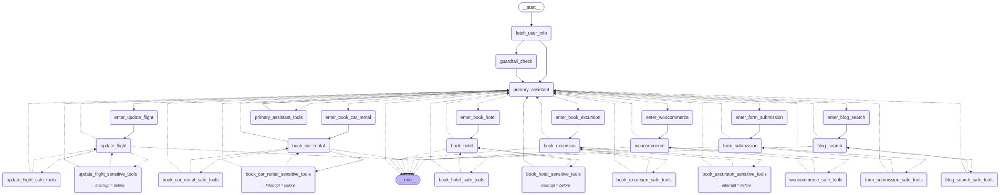
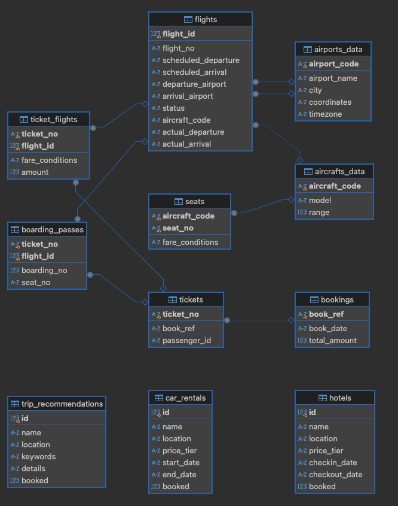

# 多智能体RAG客服系统


## 项目简介

本项目实现了一个基于多智能体（Multi-Agent）和检索增强生成（Retrieval-Augmented Generation, RAG）技术的客户支持系统。它利用 Python、LangChain 和 LangGraph 构建了一个能够处理各种旅行相关查询的对话式 AI，包括航班预订、租车、酒店预订和行程推荐。还有对接了woocommerce商城进行商品查询，文章查询，表单提交，订单查询等商城功能。
本项目fork自 https://github.com/ro-anderson/multi-agent-rag-customer-support ，一个基础的框架。

本项目在原基础上进行了重大功能扩展，新增了安全护栏机制（越狱防护和相关性检查）和基于 GoHumanLoop 的人工审核流程，极大地提升了系统的安全性和可控性。

### 多智能体RAG系统流程图


## 架构概览

系统采用多智能体架构，使用 LangGraph 实现为状态图。以下是主要组件说明：

1.  **主助手 (Primary Assistant)**: 用户查询的入口点。它根据用户需求将对话路由到专门的助手。
2.  **专业助手 (Specialized Assistants)**:
    *   **航班预订助手**: 处理航班相关的查询和预订。
    *   **租车助手**: 管理租车请求。
    *   **酒店预订助手**: 处理酒店预订查询。
    *   **行程推荐助手**: 处理旅行和活动推荐。
    *   **WooCommerce助手**: 处理电商产品和订单查询。
    *   **表单提交助手**: 处理用户表单提交。
    *   **博客搜索助手**: 处理博客文章搜索。
3.  **工具节点 (Tool Nodes)**: 每个助手都可以访问 *```安全```* 和 *```敏感```* 工具。安全工具无需用户确认即可使用，而敏感工具在执行前需要用户确认。
4.  **路由逻辑 (Routing Logic)**: 系统使用 *```条件边```* 根据当前状态和用户输入在助手和 *```工具节点```* 之间路由对话。
5.  **用户确认 (User Confirmation)**: 对于敏感操作，系统会暂停并请求用户确认后再继续。
6.  **安全与确认机制 (Security and Confirmation Mechanisms)**:
    *   **敏感操作确认**: 用户必须确认所有可能修改数据的操作。
    *   **安全护栏**: 在处理用户输入前，系统会通过AI代理进行越狱防护和相关性检查。
    *   **人工审核 (GoHumanLoop)**: 敏感操作在用户确认后，还需通过 GoHumanLoop 框架发送给管理员进行最终审核（例如通过飞书通知）。


## 项目结构

本项目包含两个主要服务:

1.  **Vectorizer**: 为知识库生成向量嵌入。
2.  **Customer Support Chat**: 主对话式 AI 系统。
3.  **faq_documents**: 知识库文档，用于生成向量嵌入。
4.  **web_app**: web界面版本，用于与用户交互。
5.  **graphs**: 包含系统图的目录，用于可视化系统架构。
6.  **faq_extension**: 新增的知识库文档目录，用于独立的生成向量嵌入。


Customer Support Chat 服务依赖于 Vectorizer 生成的向量数据库。

## 数据源与向量数据库

本项目使用两个主要数据源:

1.  **旅行数据库**:
    一个来自 LangGraph 的旅行数据库基准。这个 SQLite 数据库存储了航班、预订、乘客和其他旅行相关数据。

    

    数据来源: [LangGraph Travel DB Benchmark](https://storage.googleapis.com/benchmarks-artifacts/travel-db)

2.  **Qdrant**:
    一个用于存储和查询旅行数据库向量嵌入的向量数据库。

    

---
